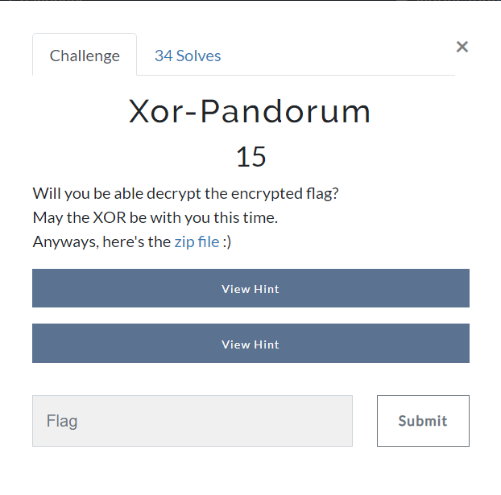

# Xor-Pandorum
### Category: Cryptography

### Prompt:


We are given a zip file. Extract it to get two files: **encrypt.py** and **encrypted_flag.txt**

This is the encrypt.py:
```python
flag=list("Once upon a time the original flag was here...")
base=1
sum=1
l=len(flag)
for i in range(0,l+1,2):
    for j in range(i):
        flag[j]=chr(ord(flag[j])^1337)
    base<<=1
    sum^=base
for i in range(1,l+1,2):
    for j in range(i):
        flag[j]=chr(ord(flag[j])^42)
    base<<=1
    sum^=base

for i in range(l):
    flag[i]=chr(ord(flag[i])<<1)

enc_flag="".join(flag)

print(enc_flag) # present in 'encrypted_flag.txt'
```

Looking at this, we can see that first all the even indices of the flag are XORed with 1337, and then the odd indices are XORed with 42.
After this, each character of the flag is left shifted by 1.
The sum and the base variables are practically useless as they don't really take part in encrypting the flag.

Now, XOR is a reversible operation, i.e. if A XOR B = C, then A XOR C = B and B XOR C = A. So, we can easily reverse this.
I wrote the script (Basically modified the given script a bit):

```python
f = open("encrypted_flag.txt","rb")
flag = list(f.read().decode().strip())
f.close()

l=len(flag)

for i in range(l):
    flag[i]=chr(ord(flag[i])>>1)

for i in range(0,l+1,2):
    for j in range(i):
        flag[j]=chr(ord(flag[j])^1337)

for i in range(1,l+1,2):
    for j in range(i):
        flag[j]=chr(ord(flag[j])^42)


dec_flag="".join(flag)

print(dec_flag)
```

Running this, I got the flag:
```
zionctf{ju5t_7he_r3gul4r_x0r_s7uff_yeetyeet}
```