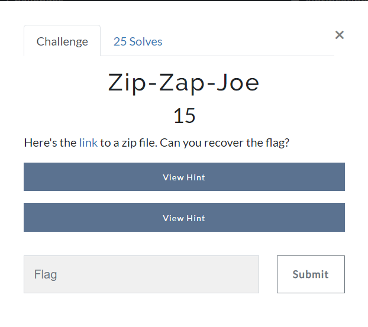
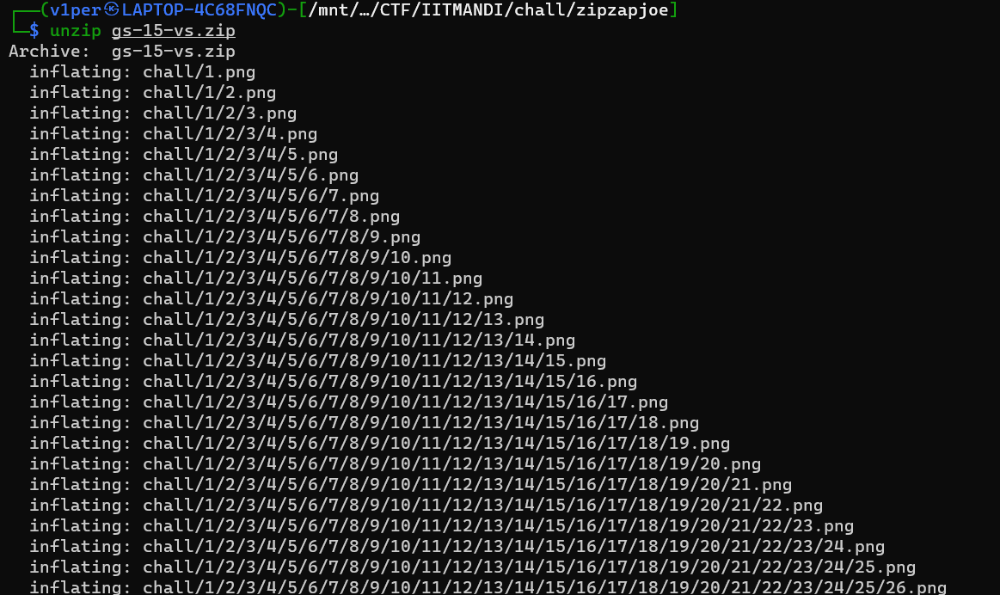
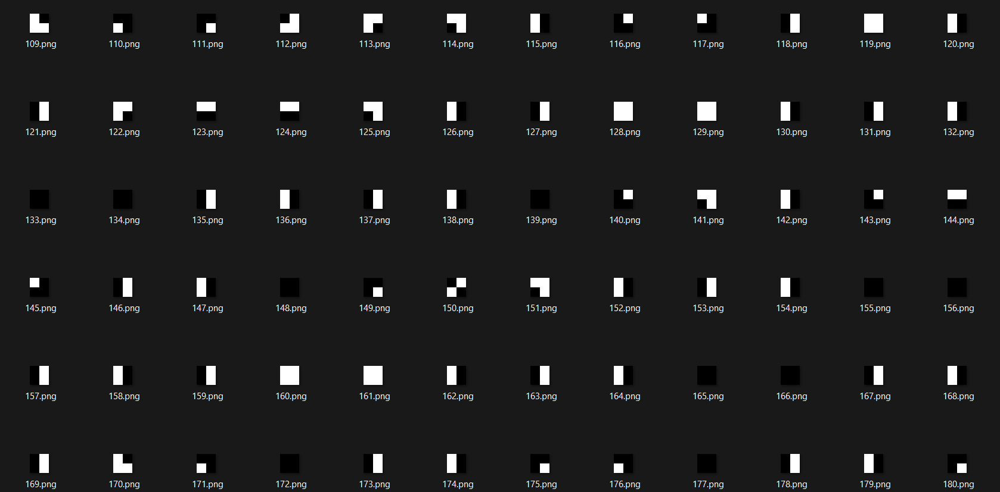

# Zip-Zap-Joe
### Category: General

### Prompt:


We are given a zip file.
The first natural thing which comes to mind after seeing a zip is, well, extracting it.
So i did it using **unzip**

```bash
unzip gs-15-vs.zip
```

It inflated to a LOT of directories (and when I say 'a LOT', I mean 'A LOT')



Each directory has an image, as well as another directory, which again contains an image and a directory, and so on.

Seeing the images, I thought of first extracting them to the same folder.
I did that using **7zip**.

```bash
7z e gs-15-vs.zip
```



These images looked like they could make something if seen together. So, I thought of combining them together.
There were a total of 1024 images, i.e. they could make a square of size 32x32.
I wrote a python script:

```python
from PIL import Image

def get_concat_h(im1, im2):
    dst = Image.new('RGB', (im1.width + im2.width, im1.height))
    dst.paste(im1, (0, 0))
    dst.paste(im2, (im1.width, 0))
    return dst

def get_concat_v(im1, im2):
    dst = Image.new('RGB', (im1.width, im1.height + im2.height))
    dst.paste(im1, (0, 0))
    dst.paste(im2, (0, im1.height))
    return dst

f=[]
for i in range(1, 1025, 32):
    print(i)
    temp = Image.open(f'{i}.png')
    f.append(temp)

k=0
for i in range(2, 1025, 32):
    print(i)
    for j in range(i, i+31):
        temp = Image.open(f'{j}.png')
        f[k] = get_concat_h(f[k], temp)
    k+=1

final=f[0]
for i in range(1, 32):
    final = get_concat_v(final, f[i])

final.show()
```

Running the script, I got this QR:


Scanning the QR gave me the flag:
```
zionctf{We1C0m3_t0_7H3_Z1On_C7F_Obl4di0B14Da}
```