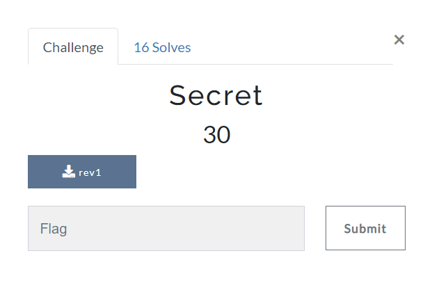

# Secret
### Category: Reverse Engineering

### Prompt:


We are given a binary. I tried to execute it but it wasn't getting executed because I had an older LIBC version.
Anyways, I opened it using **Ghdidra** and looked at the **entry** function.

```c
void entry(undefined8 param_1,undefined8 param_2,undefined8 param_3)

{
  undefined8 in_stack_00000000;
  undefined auStack8 [8];
  
  __libc_start_main(FUN_00101179,in_stack_00000000,&stack0x00000008,0,0,param_3,auStack8);
  do {
                    /* WARNING: Do nothing block with infinite loop */
  } while( true );
}
```

So, the main function here is **FUN_00101179**. Let's check that out.
```c
undefined8 FUN_00101179(int param_1,long param_2)

{
  char cVar1;
  undefined *puVar2;
  size_t sVar3;
  long in_FS_OFFSET;
  uint local_5c;
  int local_54;
  char local_48 [56];
  long local_10;
  
  local_10 = *(long *)(in_FS_OFFSET + 0x28);
  if (1 < param_1) {
    puVar2 = (undefined *)malloc(0x20);
    *puVar2 = 0x58;
    puVar2[1] = 0x72;
    puVar2[2] = 0x12;
    puVar2[3] = 0x6d;
    puVar2[4] = 0x49;
    puVar2[5] = 0xa1;
    puVar2[6] = 0x46;
    puVar2[7] = 0x6c;
    puVar2[8] = 0x20;
    puVar2[9] = 0x6b;
    puVar2[10] = 0x54;
    puVar2[0xb] = 0x66;
    puVar2[0xc] = 99;
    puVar2[0xd] = 0x92;
    puVar2[0xe] = 0x2a;
    puVar2[0xf] = 0x9e;
    puVar2[0x10] = 0x5a;
    puVar2[0x11] = 0x94;
    puVar2[0x12] = 0x34;
    puVar2[0x13] = 0x7f;
    puVar2[0x14] = 0x68;
    puVar2[0x15] = 0x81;
    puVar2[0x16] = 0x3a;
    puVar2[0x17] = 0x9b;
    puVar2[0x18] = 0x86;
    puVar2[0x19] = 0x8d;
    puVar2[0x1a] = 0x83;
    puVar2[0x1b] = 0x88;
    puVar2[0x1c] = 0x81;
    puVar2[0x1d] = 0x92;
    puVar2[0x1e] = 0x80;
    puVar2[0x1f] = 0x9b;
    strncpy(local_48,*(char **)(param_2 + 8),0x20);
    sVar3 = strlen(local_48);
    if (sVar3 == 0x20) {
      cVar1 = ' ';
      for (local_5c = 0; (int)local_5c < 0x20; local_5c = local_5c + 1) {
        local_48[(int)local_5c] = (char)local_5c + cVar1 * '\x02' + local_48[(int)local_5c];
        if ((local_5c & 1) == 0) {
          local_48[(int)local_5c] = local_48[(int)local_5c] + cVar1 * -3 + -5;
        }
        cVar1 = cVar1 + -1;
      }
      for (local_54 = 0; local_54 < 0x20; local_54 = local_54 + 1) {
        if (local_48[local_54] != puVar2[local_54]) goto LAB_0010140d;
      }
      puts("That\'s the correct flag!");
    }
  }
LAB_0010140d:
  if (local_10 == *(long *)(in_FS_OFFSET + 0x28)) {
    return 0;
  }
                    /* WARNING: Subroutine does not return */
  __stack_chk_fail();
}
```

This was an easy script to reverse. I wrote this:
```python
puVar2 = [0x58, 0x72, 0x12, 0x6d, 0x49, 0xa1, 0x46, 0x6c, 0x20, 0x6b, 0x54, 0x66, 99, 0x92, 0x2a, 0x9e, 0x5a, 0x94, 0x34, 0x7f, 0x68, 0x81, 0x3a, 0x9b, 0x86, 0x8d, 0x83, 0x88, 0x81, 0x92, 0x80, 0x9b]

cVar1 = ord(' ')
for local_5c in range(0x20):
    
    puVar2[local_5c] = puVar2[local_5c] - (local_5c + cVar1*2)
    if(local_5c&1 == 0):
        puVar2[local_5c] = puVar2[local_5c] - (cVar1 * -3 + -5)
    
    cVar1 -= 1

puVar2.reverse()

puVar2 = bytearray(puVar2).decode()

print(puVar2)
```

Running this, I got the flag:
```
zionctf{r3VeR5e_m3_p1e453_ff033}
```