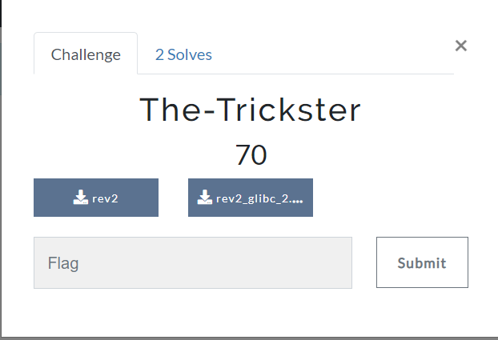

# The-Trickster
### Category: Reverse Engineering

### Prompt:


We are given a binary. On running it, it asks for a flag, and tells us if the flag is correct or not.
I opened the binary using Ghidra.

```c
undefined8 main(void)

{
  uint uVar1;
  long lVar2;
  uint uVar3;
  char *pcVar4;
  char acStack72 [72];
  
  change_perms((ulong)main);
  write(1,"Enter the flag << ",0x12);
  read(0,acStack72,0x30);
                    /* WARNING: Read-only address (ram,0x00101226) is written */
  uRam0000000000101226 = 200;
                    /* WARNING: Read-only address (ram,0x0010122a) is written */
  uRam000000000010122a = 0xc2;
  uVar1 = 0;
  pcVar4 = (char *)0x1011f5;
  do {
    uVar1 = uVar1 & 0xffffff00 | (uint)(byte)((char)uVar1 + *pcVar4);
    uVar1 = uVar1 << 1 | (uint)((int)uVar1 < 0);
    pcVar4 = pcVar4 + 1;
  } while (pcVar4 != "\'\x0e");
  uVar1 = uVar1 ^ 0x69f420;
  lVar2 = 0;
  do {
    uVar3 = ((int)acStack72[lVar2] << 1 | (uint)(acStack72[lVar2] < 0)) ^ uVar1;
    uVar1 = uVar1 >> 1 | (uint)((uVar1 & 1) != 0) << 0x1f;
    if (*(int *)(arr + lVar2 * 4) != uVar3 + (int)*(char *)(lVar2 + 0x101215)) {
      write(1,"Wrong flag\n",0xb);
      return 0;
    }
    lVar2 = lVar2 + 1;
  } while (lVar2 != 0x20);
  write(1,"Correct flag\n",0xd);
                    /* WARNING: Read-only address (ram,0x00101226) is written */
                    /* WARNING: Read-only address (ram,0x0010122a) is written */
  return 0;
}
```

This was the main function.
Now, seeing the script, I notice that, the number of times the second do-while loop runs is equal to the number of characters in our flag from the beginning which are correct. So, I thought of writing a **Python GDB script** for this.

I opened the binary in GDB:
```
gdb rev2
```

I disassembled the main function by:
```
disas main
```

```bash
   0x0000000000001199 <+0>:     sub    rsp,0x48
   0x000000000000119d <+4>:     lea    rdi,[rip+0xfffffffffffffff5]        # 0x1199 <main>
   0x00000000000011a4 <+11>:    call   0x1165 <change_perms>
   0x00000000000011a9 <+16>:    mov    edx,0x12
   0x00000000000011ae <+21>:    lea    rsi,[rip+0xe4f]        # 0x2004
   0x00000000000011b5 <+28>:    mov    edi,0x1
   0x00000000000011ba <+33>:    call   0x1030 <write@plt>
   0x00000000000011bf <+38>:    mov    rsi,rsp
   0x00000000000011c2 <+41>:    mov    edx,0x30
   0x00000000000011c7 <+46>:    mov    edi,0x0
   0x00000000000011cc <+51>:    call   0x1040 <read@plt>
   0x00000000000011d1 <+56>:    mov    BYTE PTR [rip+0x4e],0xc8        # 0x1226 <main+141>
   0x00000000000011d8 <+63>:    mov    BYTE PTR [rip+0x4b],0xc2        # 0x122a <main+145>
   0x00000000000011df <+70>:    mov    eax,0x0
   0x00000000000011e4 <+75>:    lea    rdx,[rip+0xa]        # 0x11f5 <main+92>
   0x00000000000011eb <+82>:    lea    rsi,[rdx+0x20]
   0x00000000000011ef <+86>:    mov    ecx,eax
   0x00000000000011f1 <+88>:    mov    cl,0x0
   0x00000000000011f3 <+90>:    add    al,BYTE PTR [rdx]
   0x00000000000011f5 <+92>:    movzx  eax,al
   0x00000000000011f8 <+95>:    or     eax,ecx
   0x00000000000011fa <+97>:    rol    eax,1
   0x00000000000011fc <+99>:    add    rdx,0x1
   0x0000000000001200 <+103>:   cmp    rdx,rsi
   0x0000000000001203 <+106>:   jne    0x11ef <main+86>
   0x0000000000001205 <+108>:   xor    eax,0x69f420
   0x000000000000120a <+113>:   mov    ecx,0x0
   0x000000000000120f <+118>:   mov    r9,rsp
   0x0000000000001212 <+121>:   lea    r8,[rip+0xe27]        # 0x2040 <arr>
   0x0000000000001219 <+128>:   lea    rdi,[rip+0xfffffffffffffff5]        # 0x1215 <main+124>
   0x0000000000001220 <+135>:   movsx  edx,BYTE PTR [rcx+r9*1]
   0x0000000000001225 <+140>:   rol    edx,1
   0x0000000000001227 <+142>:   xor    edx,eax
   0x0000000000001229 <+144>:   ror    eax,1
   0x000000000000122b <+146>:   movsx  esi,BYTE PTR [rdi+rcx*1]
   0x000000000000122f <+150>:   add    edx,esi
   0x0000000000001231 <+152>:   cmp    DWORD PTR [r8+rcx*4],edx
   0x0000000000001235 <+156>:   jne    0x1259 <main+192>
   0x0000000000001237 <+158>:   add    rcx,0x1
   0x000000000000123b <+162>:   cmp    rcx,0x20
   0x000000000000123f <+166>:   jne    0x1220 <main+135>
   0x0000000000001241 <+168>:   mov    edx,0xd
   0x0000000000001246 <+173>:   lea    rsi,[rip+0xdd6]        # 0x2023
   0x000000000000124d <+180>:   mov    edi,0x1
   0x0000000000001252 <+185>:   call   0x1030 <write@plt>
   0x0000000000001257 <+190>:   jmp    0x126f <main+214>
   0x0000000000001259 <+192>:   mov    edx,0xb
   0x000000000000125e <+197>:   lea    rsi,[rip+0xdb2]        # 0x2017
   0x0000000000001265 <+204>:   mov    edi,0x1
   0x000000000000126a <+209>:   call   0x1030 <write@plt>
   0x000000000000126f <+214>:   mov    eax,0x0
   0x0000000000001274 <+219>:   add    rsp,0x48
   0x0000000000001278 <+223>:   ret
```

The jne statement in line number 166 is the instruction where the loop jumps back. So, we'll put a breakpoint there, and then bruteforce our flag!

I wrote this python script:
```python
import gdb
import re

flag="zionctf{"
charset="abcdefghijklmnopqrstuvwxyzABCDEFGHIJKLMNOPQRSTUVWXYZ_{}0123456789"
gdb.execute('break *main+166')

while 1:
    for char in charset:
        newflag=flag+char
        gdb.execute(f'run < <(echo -ne "{newflag}")', to_string=True)
        while 1:
            try:
                gdb.execute('c', to_string=True)
            except:
                output=gdb.execute('i b', to_string=True)
                break

        parsedoutput=re.findall("hit .*", output)
        hits=int(parsedoutput[0].split()[1])
        if len(newflag)==hits:
            flag=newflag
            f=open("found_flag.txt","w")
            f.write(flag)
            f.close()
    if len(flag)==32:
        break
print(flag)
```

I saved this script in the same directory in which I had opened GDB by the name **script.py**.
In the GDB session, I ran:
```
source script.py
```

I waited for a few mins, and in the **found_flag.txt**, I got the flag:
```
zionctf{r3VeR51nG_1s_FuN_b8af2c}
```
