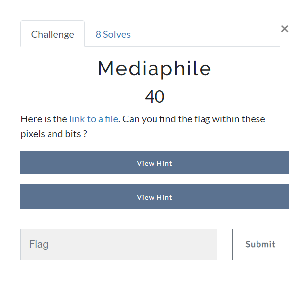

# Mediaphile
### Category: Steganography

### Prompt:


**solution**

We were given a video file.So initially we tried mkvtools but they were not useful.Next 
we saw that  the video had subtitle which suggested of splitting the video into frames
and it also gave us info about some key and replacing the question marks in some mssg with that key.

So first of all we splitted the video using ffmpeg with the command
```
ffmpeg -i video.mkv "video.%04d.png"
```

we got 79 frames. And, in every frame there was some noise.We were informed about some key and hence we tried to XOR all the frames but it gave nothing and there was still noise in the image.So, i tried various bitwise operations to ombine all the frames like addition,and etc etc but there was still noise in the images.However , if we combine all the frames with OR operation it cancelled the noise and we can see a QR forming at the bottom.Then I wrote a python script to make the operation easy for me.

```python

from PIL import Image, ImageChops, ImageOps
import cv2

images=["INIT"]
for x in range(1,80):
    filename=str(x).zfill(2)
    # images.append(Image.open(f"{filename}.png",mode="RGB"))
    images.append(cv2.imread(f"{filename}.png"))


vis = cv2.bitwise_or(images[1], images[2])
for x in range(3,79):
    vis=cv2.bitwise_or(vis,images[x])
cv2.imwrite('out.png', vis)
```


Got an image with a QR below it.Scanned the QR to get half the flag
```
zionctf{H4ck-th3-v1d30-????????}
```
Then, it was said in the video subtitles that
```
[@info] the quoted key lies just before this sentence [@info]
```
and hence we extracted the video subtitles and got the other part
```
uWe98q17
```

we had to replace the question marks with the "so called key/token" to get our flag

```
zionctf{H4ck-th3-v1d30-uWe98q17}
```
