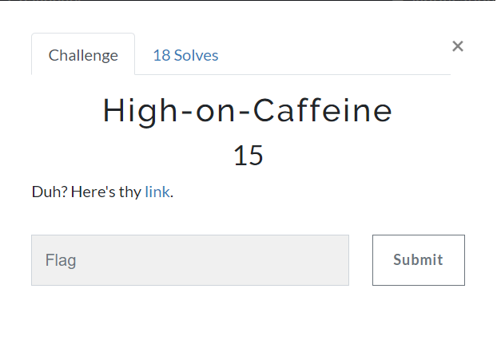
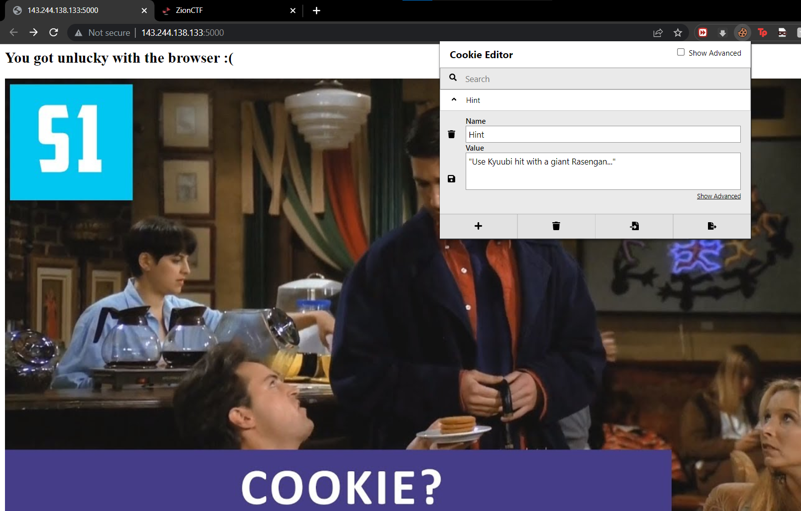
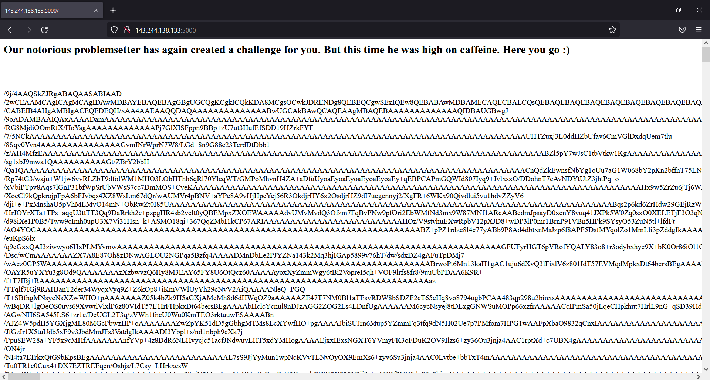
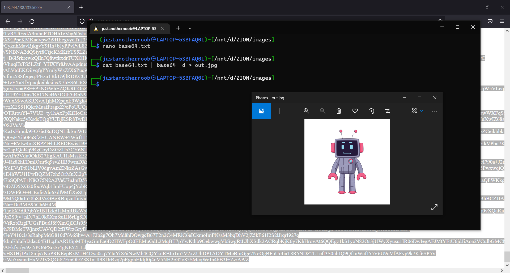
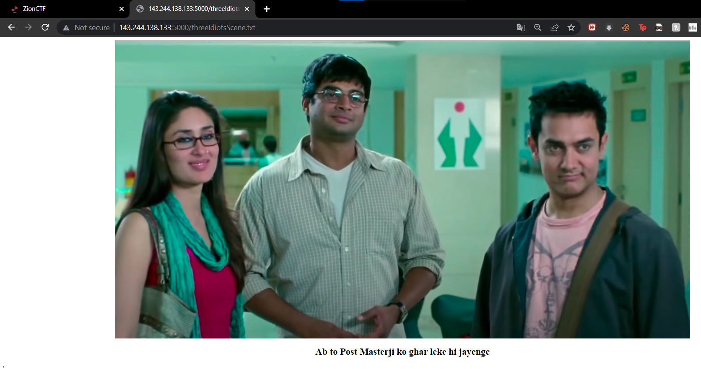

# High-on-Caffeine
### Category: Web Exploitation

### Prompt:


Visiting the website http://143.244.138.133:5000/
treats us with the following webpage



Opening up the website in a different browser i.e a different user agent. In this case, firefox works.

We are greeted with a different web page this time



Looking at ```/9j/4AAQSkZJRgABAQAASABIAAD``` directly indicates base64 of a jpg image.
I have provided the b64 data in /source in my GitHub repository.
Decoding the b64 data and saving it to a jpg file. We get



A clear cut hint towards robots.txt.
Visiting robots.txt should have been the first thing but lel, here we go.

The robots.txt contains
```
dGhyZWVJZGlvdHNTY2VuZS50eHQ=
```
decoding it we get
```
threeIdiotsScene.txt
```
Visiting the file yields the following page,



A direct hint towards POST request

```bash
┌──(justanothernoob㉿LAPTOP-5SBFAQ0I)-[~]
└─$ curl -X POST http://143.244.138.133:5000/threeIdiotsScene.txt
zionctf{chr0m3_chr0m3_chr0m3_I_d0n7_lik3_a4gl0md1_I_c4n7_av0id}
┌──(justanothernoob㉿LAPTOP-5SBFAQ0I)-[~]
└─$
```

And here we go, we have the flag
