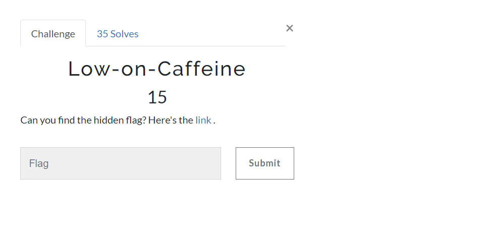
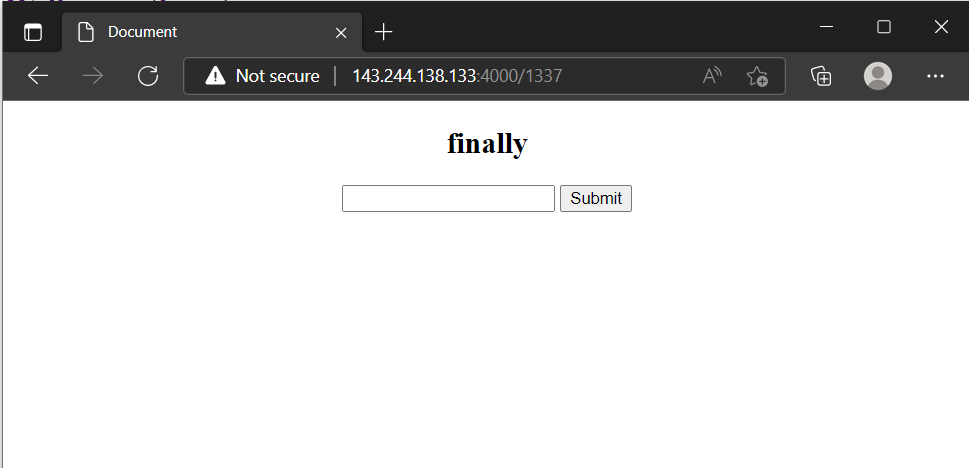

# Low-on-Caffeine
### Category: Web Exploitation

### Prompt:


We are given a website with the following prompt

```
Our naughty problemsetter has created this problem for you. Unfortunately he had a mental breakdown while creating it due to a lack of coffee. Still he managed to hide the flag. Can you find it?

[Well go on then :)](http://143.244.138.133:4000/1)
```
Pressing the hyperlink, we are redirected to a page containing text from Lorem Ipsum.
http://143.244.138.133:4000/1 => ipsum
http://143.244.138.133:4000/2 => dolor
Each page has a submit button, pressing it, redirects us to the next page. And if the button isn't pressed within 5-6 seconds, we are redirect back to the starting page.

So, a simple manual binary search OR a logical guess would lead you to index **1337**.


Viewing the source
```html
<!DOCTYPE html>
<html lang="en">
<head>
<meta charset="UTF-8">
<meta http-equiv="X-UA-Compatible" content="IE=edge">
<meta name="viewport" content="width=device-width, initial-scale=1.0">
<title>Document</title>
</head>
<body>
<div style="text-align: center;">
<h2 id="ff">finally</h2>
<input id="tt" type="text">
<button onclick="func()">Submit</button>
</div>
<script src="[/static/fin.js](http://143.244.138.133:4000/static/fin.js)"></script>
</body>
</html>
```

The javascript file fin.js
```js
function func() {
    var p = document.getElementById("tt").value;
    if (p === "finally") window.location.href = "/807d0fbcae7c4b20518d4d85664f6820aafdf936104122c5073e7744c46c4b87"
    else window.location.href = "/"
}
```
So, visiting http://143.244.138.133:4000/807d0fbcae7c4b20518d4d85664f6820aafdf936104122c5073e7744c46c4b87
gives us the flag
```
zionctf{av01d_th1nk1n8_7o0_mucH}
```
